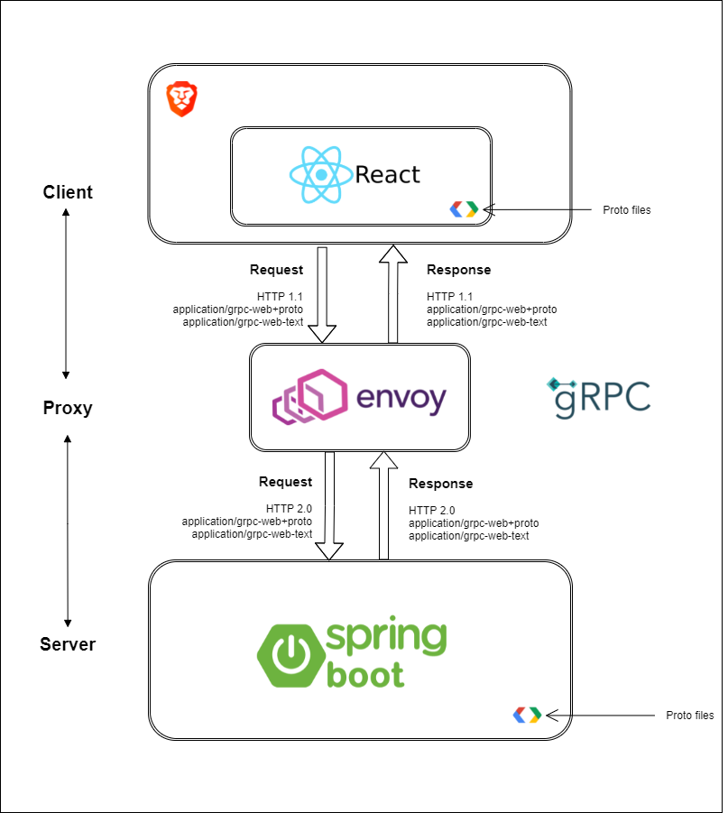

# gRPC client-server PoC
This project is a test of high performance Remote Procedure Call (RPC) framework called **gRPC**. Thanks to protocol buffer, it works for many modern programming languages, but for the sake of this project the **JavaScript** and **Java** were used (no, they are not the same duh...). 
  

## PoC
Create a connection between front-end and back-end written in 
modern frameworks using **gRPC**. 

## Front-end
Front-end is written in **React** and created using `create-react-app`. 
This part is used to call gRPC methods described in `.proto` file.

## Back-end
Back-end is written in **Java** using **Spring Boot** framework. 
For gRPC quick integration and configuration the [gRPC-Spring-Boot-Starter](https://yidongnan.github.io/grpc-spring-boot-starter/en/)
was used. This part is used to implement gRPC methods described in `.proto` file.

## Proxy
[Envoy](https://www.envoyproxy.io/) was used for the proxy. The server is running in a docker container. 
This part is used to convert request calls from protocol **HTTP 1.1** to **HTTP 2.0**.

## Usage
Go to folders: `server`, `proxy`, `client` and run them respectively. There is separate `README.md` for each component, so running whole infrastructure should not be a problem.

There is also a way to run a whole project with `docker-compose`. Just run command:

    docker-compose up -d

Then open a browser on [http://localhost:3000/](http://localhost:3000/) and test the API. 

## Source links
* https://grpc.io/
* https://github.com/marcosmartinez7/grpc-react-example
* https://daily.dev/blog/build-a-chat-app-using-grpc-and-reactjs
* https://yidongnan.github.io/grpc-spring-boot-starter/en/